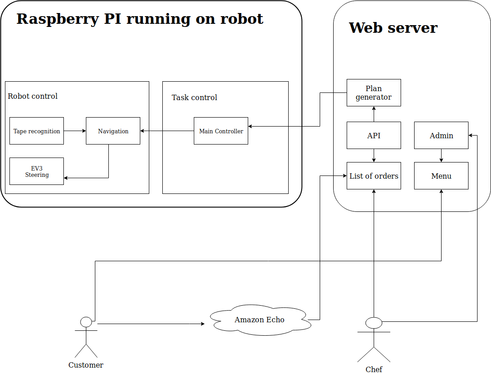

# Sixers - SDP Group 6

# Modules

# GIT workflow:

- for new features where you are not owner of the code create a branch
  - base your branch on latest version of master ``git pull --rebase`` ensures that you have the latest branch.
  - you can create a new branch using ``git checkout -b <new branch name>``
  - after you are done adding some code, ``git push`` will display you instructions for pushing a new branch.
- you can switch to existing branch using ``git checkout <branch name>``
- after you feel ready create a pull request, select a branch and preview your changes

# Links:
- [Google folder](https://drive.google.com/drive/folders/1-3mFlIckR9XfrBqigKiz7-sDPVg_fLFM) - In order to access you need to loging using your pre-approved Google account first.
